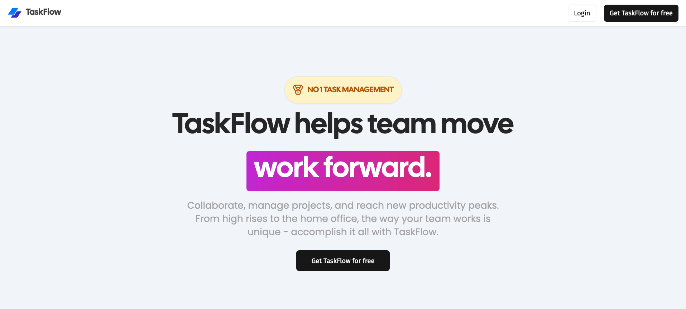

# Live page - https://task-flow-lac.vercel.app/



# TaskFlow: Collaborate, manage projects, and reach new productivity peaks

### Technologies used: Next.js 14, Server Actions, React, Prisma, Stripe, Tailwind, PostgreSQL

Key Features:

-   Authentication using Clerk
-   Support for Organizations and Workspaces
-   Ability to create Boards with random cover images from Unsplash
-   Activity log tracking for the entire organization
-   Board management including renaming and deletion
-   Creation and management of Lists (creation, renaming, deletion, reorder via drag & drop, and copying)
-   Creation and management of Cards (including description, renaming, deletion, reorder via drag & drop, and copying)
-   Activity log for individual Cards
-   Board limits set for each organization
-   Subscription functionality via Stripe for organizations to access unlimited boards
-   A dedicated landing page
-   Backed by a PostgreSQL database
-   Utilizing Prisma ORM for database interactions
-   Designed with shadcnUI and TailwindCSS for the user interface.

### Prerequisites

**Node version 18.x.x**

### Cloning the repository

```shell
git clone https://github.com/abishek-as/TaskFlow.git
```

### Install packages

```shell
npm i
```

### Setup .env file

```js
NEXT_PUBLIC_CLERK_PUBLISHABLE_KEY=
CLERK_SECRET_KEY=
NEXT_PUBLIC_CLERK_SIGN_IN_URL=
NEXT_PUBLIC_CLERK_SIGN_UP_URL=
NEXT_PUBLIC_CLERK_AFTER_SIGN_IN_URL=
NEXT_PUBLIC_CLERK_AFTER_SIGN_UP_URL=

DATABASE_URL=

NEXT_PUBLIC_UNSPLASH_ACCESS_KEY=

STRIPE_API_KEY=

NEXT_PUBLIC_APP_URL=

STRIPE_WEBHOOK_SECRET=
```

### Setup Prisma

Add PostgreSQL Database (I used Supabase)

```shell
npx prisma generate
npx prisma db push
```

### Start the app

```shell
npm run dev
```

## Images

### Boards Overview of Pro Organization


### Free Overview of Pro Organization


### Board and Lists Overview


### Card Overview


### Activity


### Organization Settings


